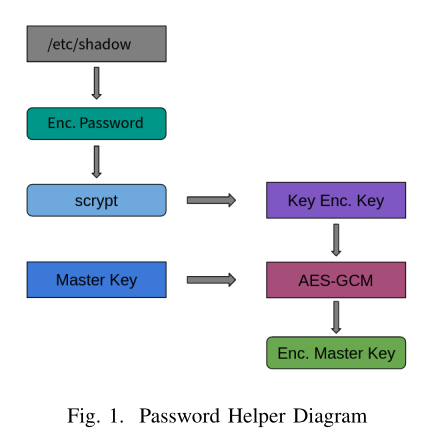
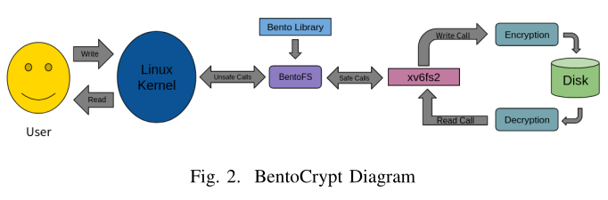

# BentoCrypt
BentoCrypt is a stacked, encrypted, kernel-level Linux file system in 
development using Rust and the Bento framework.

This is the REU project of Prathik Gowda under the guidance of Professor Chandy 
at the University of Connecticut for the Summer of 2021.

## Motivation
Two of the biggest threats to the security of file systems
are memory safety vulnerabilites and unencrypted data. While there are file
systems which address both of these issues (see gocryptfs), their
performance is tightly constrained by their limitation to the userspace rather
than kernel level. This means that these file systems have limited consumer 
utility due to their relative inefficiency.

By developing a memory-safe, encrypted file system utilizing the new 
kernel-level Bento framework for file system development, we hope to bridge this
 gap in providing a safe, secure, and performant file system model.

## Design
BentoCrypt's design is composed of three separate components: *pwd* our password
helper program, *encryption* our AES-GCM encryption library, and 
*xv6fs_encrypted* the encrypted file system itself. 

### *pwd*: The Password Helper Program
Our password helper program retrieves the current user’s encrypted password
from /etc/shadow and produces a key encryption key (a key
to encrypt our master key) from it by using the key derivation
algorithm scrypt [7]. Next, we create our master key using
bytes from /dev/urandom and encrypt it using our key encryption 
key. Our solution prevents other users from accessing your
data, since the key encryption key is seeded from the encrypted
password which is unique to the appropriate user.
To retrieve the user’s encrypted password we were forced to
call unsafe C functions - as the /etc/shadow API has not been
ported to Rust. Luckily, our design separates pwd from our file
system implementation - so the memory unsafe C code is confined to
pwd itself.

The pwd directory contains the code for the *pwd* password helper program.

### *encryption*: The Rust AES-GCM Encryption API
Safely and correctly utilizing AES-GCM encryption is difficult.
Thus, instead of directly calling the AES-GCM library
functions directly from our encrypted file system, we created an
API that provides a simpler wrapper
around Rust’s AES-GCM library. This also allows us to test
our encryption functionality in isolation on arbitrary data -
meaning that we don’t have to compile and insert a kernel
module every time we want to test encryption.
At the highest level, our API provides a function that takes
an array of bytes and a masterkey, and returns the array
of bytes encrypted with AES-GCM. 

Internally, our function
generates a nonce using bytes from /dev/urandom and verifies
the validity of our encrypted bytes before returning.
One issue that complicated development here is the resources available at the 
kernel level. While the userspace version of our file system is free to use 
the standard library, the kernel version does not have access to the standard 
library at all. Thus, this is where our project switched from userspace
programming to kernel programming. We solved this issue
by providing two versions of encryption: a kernel version
and a userspace version. The kernel version has the feature
[no_std] implemented, meaning that it will not compile with
any standard library code. The userspace version doesn’t have
this feature, and thus is free to use luxuries like Strings, Error
types, and printing to stdout.
	
The encryption_kernel directory contains code for the kernel version of our
API while the encryption_userspace contains code for the userspace version.

### *xv6fs_encrypted*: The Encrypted File System
This brings us to the heart of the project: the file system
itself. BentoCrypt is designed as a layer on-top of an existing
file system (hence, a ”stacked” file system). For our base, we
chose the xv6 file system (xv6fs) included with the Bento
framework. xv6fs is relatively simple (it has historically been
used as a teaching tool for operating systems classes), but
the Bento implementation also provides performance enhance-
ments which make it faster than the original - making it a good
candidate for our base.

Despite Bento’s ability to work at the kernel level, it still
follows the FUSE API for the most part. Thus, like FUSE
file systems, it provides data writing via the write function
(here it’s called bento write) and data reading via the read
function (here it’s called bento read). In order to keep our data
encrypted on the disk, we want to call our encryption library to
encrypt our data at the beginning of the bento write function
and decrypt our data at the beginning of the bento read
function.

## Other Directories
The bento, bento_utils, bentofs, datablock-rs are modified from the
upstream Bento project. For more documentation and information on more updated
versions of Bento, see the Bento repository 
[here](https://github.com/smiller123/bento)

The docs directory contains a more comprehensive documentation of the project.

## Development and Build Information
Due to changes in the Linux kernel's file system API and changes in the Rust
language, the project must be built with the kernel version 5.4-5.8 and
Rust language version nightly-2021-04-27. The Rust language version can easily
be changed from the command line, however using an older kernel version is more
difficult. This unfortunately means that
the kernel-level development and testing must be done on an older Linux system.
My solution was to test using an older LTS version of Ubuntu (could use a VM
rather than directly on hardware). 

## Current State of BentoCrypt
As of now, the helper program pwd is completely finished.
It runs at the user level so was not subject to the bugs related
to our linuxkernel target and lack of standard library.
The encryption library is (nearly) finished. At the user level,
it safely encrypts bytes of data and panics if the encrypted data
does not pass verification. However, since we had to disable
sse and avx2 for our kernel version, we cannot guarantee that
it works as expected at the kernel level at this point.

The file system itself, xv6fs encrypted, is unfinished. Currently, 
we call our encryption library on the data parameter
at the beginning of the bento write function, which should
theoretically ensure that the data written to disk is encrypted
with AES-GCM. However, due to the difficulties enumerated
above it’s unclear whether the call is properly encrypting the
data. We have also not yet implemented decryption on read.

## Areas for Further Development
Two components of BentoCrypt are still left unfinished. Trivially, the 
*encryption* API appears to be finished and works at the userspace level, but it
runs into serious issues at the kernel-level. Unfortunately the support for 
AES-GCM encryption is immature in Rust. Here is one bug report we filed during the
development of the encryption library which remains unresolved: 
[Rust Issue Page](https://github.com/rust-lang/rust/issues/87642). It's also
unclear whether the data is properly being encrypted and decrypted, and we have
experienced crashes during decryption (at kernel level).

For further development, either a debugging of the existing encryption 
functionality for the kernel-level, or a move towards a more mature encryption
mode would be necessary. 

## Resources
- BentoCrypt is built using the Bento framework developed by Samantha Miller,
  Kaiyuan Zhang, Mengqi Chen, and Ryan Jennings, University of Washington; Ang
  Chen, Rice University; Danyang Zhuo, Duke University; Thomas Anderson,
  University of Washington (https://gitlab.cs.washington.edu/sm237/bento).

## Contact
Reach me (Prathik Gowda) at gowdapra@grinnell.edu

Reach my mentor (John Chandy) at john.chandy@uconn.edu